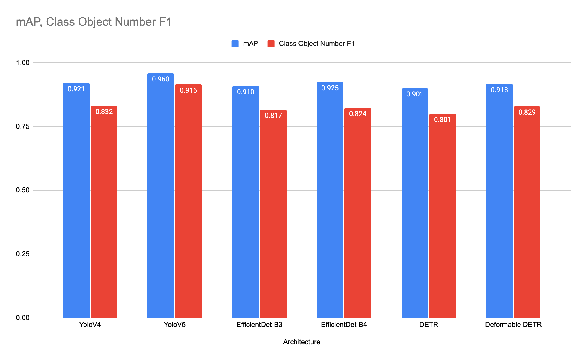
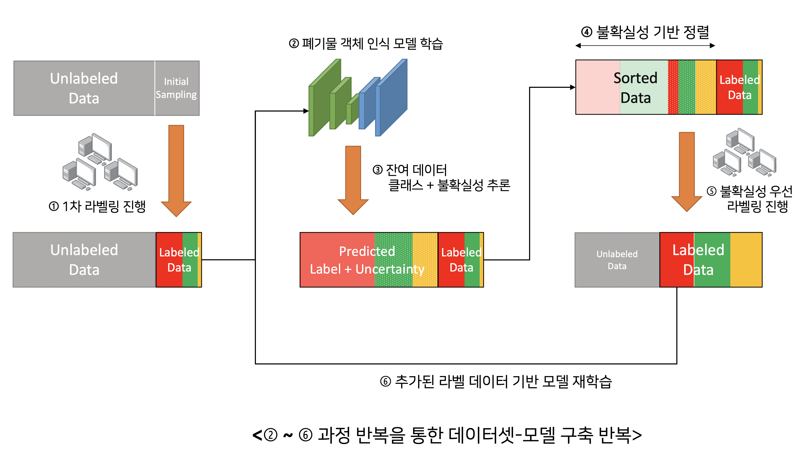
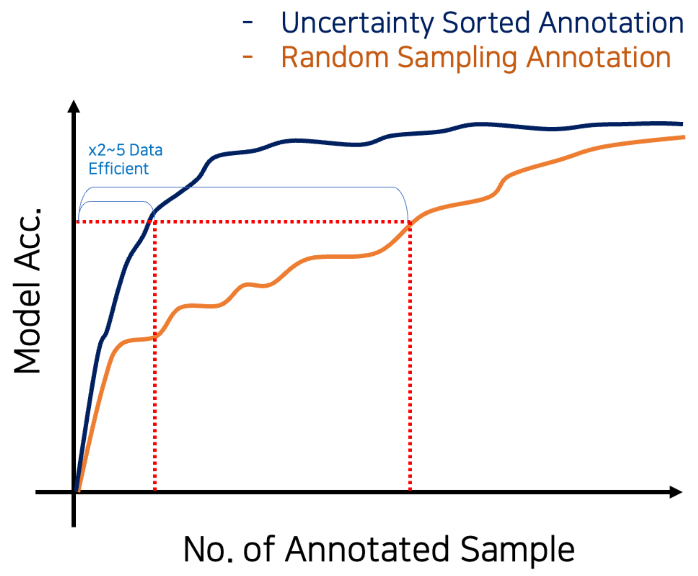
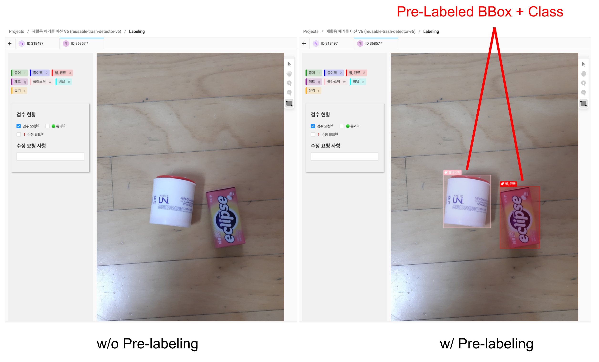

# 연구

본 저장소는 인공지능 그랜드 챌린지 4차대회 3번트랙, 생활폐기물 인지 영역에 대한 후속연구를 담고 있습니다.

Object Detection + Active Learning + 이미지 합성 증폭 알고리즘 방식을 활용하여 진행한 데이터셋 구축/학습 프로세스를 통해 연구개발전 개발하였던 Classification CNN model에 비해 비약적인 성능향상을 보여주었으며, 비정형 생활폐기물 이미지(찢김, 손상 등이 많은 이미지)에 대해서도 월등히 높은 성능을 보여주었습니다.

## Object Detection 아키텍처 선택

One-stage detector로 추론속도 및 처리 속도 면에서 우수한 성능을 보이는 Yolo계열 모델, 아키텍처 탐색을 통해 기존 fpn 형태를 개선한 EfficietDet, transformer 기반 decoder를 통해 anchor 등과 같은 후처리 알고리즘을 없애고 object detection 문제를 direct set prediction 문제로써 해결하는 (deformable)DETR등 존재하는 다양한 아키텍처 중, 본 테스크에 가장 적합한 아키텍처를 선택하기 위하여 다양한 조건에서 학습을 수행하였으며, 성능지표 및 추론속도 지표에서 모두 높은 성능을 보이는 Yolo 계열 모델로 아키텍처를 선택하였습니다.

 

 
  각 모델 아키텍처별 자체평가 결과 표

  

최종 선택한 아키텍처는 YoloV5모델로, 해당 모델을 baseline으로 하여 학습을 진행하였습니다.

## Active Learning + Pre-labeling Method

Object detection 문제에서 가장 많은 비용이 들어가는 것은 데이터셋 제작입니다. 일반적으로 단순 분류문제를 풀기위한 데이터셋 제작에 비해 한 이미지 당 약 5~10배정도의 비용이 들어가며, 시간 및 필요인력 또한 비슷한 수준의 추가가 필요합니다. 뿐만 아니라 다양한 폐기물 관련 데이터셋을 보면 한 이미지를 다양한 각도에서 찍은 사진이 많고, 하나의 폐기물 객체를 여러 이미지에서 다른 구도로 재활용한 경우가 많아 데이터셋의 분포 다양성이 떨어지는 문제가 있었습니다. 

데이터셋 다양성이 불충분한 문제로 인하여 데이터셋을 늘려도 모델의 성능 증가폭이 적었으며, overfitting되는 문제가 발생하였습니다.  이러한 문제를 극복하기 위하여 **취약 샘플 분석을 통한 우선 레이블링 샘플 선택 알고리즘**을 개발하여 학습에 추가적으로 필요한 데이터를 선별적으로 제작할 수 있었습니다.

 

 
  데이터셋 클래스 불균형 문제를 해결하기 위한 점진적 데이터셋 라벨링 과정

 

 

 
  데이터 라벨링 방식에 따른 데이터셋 수량별 모델 정확도 향상 그래프

 

또한 학습된 모델의 output 중 bbox를 pre-label로 제공하여 데이터셋 가공 효율을 증가시켰습니다.

아래 이미지에서 좌측의 경우 Pre-labeling이 적용되어 있지 않아 작업자가 직접 라벨링을 수행해야 하는 작업 공정이 필요하지만, 우측 이미지의 경우 라벨링이 필요한 이미지와 함께 1차로 학습된 모델이 예측한 Bounding Box와 폐기물 클래스가 노출되므로 라벨링 작업자 입장에서는 Bounding Box의 크기 수정과 오분류된 클래스에 대한 수정만 진행하면 되기 때문에, 라벨링 효율이 150~200% 가량 향상하는 것을 확인할 수 있습니다.

 

 
  pre-labeling 시스템

 

## 배경합성 알고리즘을 이용한 데이터셋 증폭

자체 수집한 데이터셋은 대부분이 실내에서 촬영한 이미지라는 문제를 가지고 있었습니다. 실제 사용환경 및 Testset의 경우 야외 및 특수환경에서도 촬영될 수 있으나, 실제로 기보유한 데이터셋의 경우 야외 배경에서 매우 취약한 문제가 존재하였습니다. 이를 극복하기 위하여 random bbox 배경합성 알고리즘을 통해 데이터 증폭을 진행하였습니다. 과정은 아래와 같습니다.

1. 다양한 배경 데이터셋을 준비 - 약 100여장의 배경 데이터셋 준비(야외, 벤치, 아스팔트, 나무, 잔디 등)
2. 폐기물 이미지에 대하여 Augmentation 적용 후 bbox에 random margin을 주고 cropping
3. cropping 된 object set에서 random하게 오브젝트들을 query 하여 1의 배경에 합성

 

 
  사용한 배경 이미지

 

 

 
  배경 합성을 통해 생성된 이미지 사진

 

### 합성 이미지 수/비율 증가에 따른 성능표

| Base Dataset Num | Background Image Num | Manipulate Num |  mAP  | Class Object Number F1 |
|:----------------:|:--------------------:|:--------------:|:-----:|:----------------------:|
|            20000 |                    0 |              0 | 0.951 |                  0.898 |
|            20000 |                   50 |          10000 | 0.953 |                  0.902 |
|            20000 |                  100 |          20000 | 0.953 |                  0.903 |
|            36735 |                    0 |              0 | 0.960 |                  0.916 |
|            36735 |                   50 |          10000 | 0.959 |                  0.914 |
|            36735 |                  100 |          10000 |  0.96 |                  0.919 |
|            36735 |                  100 |          20000 | 0.963 |                   0.92 |
|            36735 |                  100 |          30000 | 0.963 |                  0.923 |
|            36735 |                  100 |          40000 | 0.961 |                  0.921 |

## Validation Set Augmentation 평가를 통한 Sample distribution discrepancy 해소

연구과정에서 실제 활용단계에서 처음보는 sample 에 대한 성능을 validation set 성능지표 가 반영하고 있지 못하다고 판단하였습니다. 실제로 2020년 참여한 인공지능 그랜드 챌린지에서 89.44%라는 f1 score 로 우승하였으나, 자체적인 validation dataset으로 평가한 자체 성능평가 지표는 95%이상이었습니다. 뿐만아니라, 제출했던 모델 중 가장 높은 성능을 보인 모델은 제출한 다른 모델에 비해 자체 평가데이터셋에 대해서는 성능이 낮은 모델이었는데요. 즉, 자체적으로 평가한 모델의 성능지표가 처음보는 dataset에 대해 완벽히 대변하지 못한다는 것을 의미하였습니다. 

이는 연구개발과정에서 validation dataset의 성능지표를 기반으로 모델을 개선하기 때문에, 개선의 방향이 validation set에 overfitting 될 수 있기 때문으로 판단하였고, 이를 극복하기 위하여 validation set의 평가방식에 augmentation 및 배경합성 알고리즘을 적용하여, 주어진 validation dataset의 real world sample distribution discrepancy를 해소하였습니다.

실제 대회의 평가데이터셋으로 ablation study를 진행한 결과 단순 validation set 테스트 지표로 평가한 모델에 비하여 augmentation을 적용하여 평가한 방식에서의 모델의 성능지표 경향성이 일치하였습니다.

| model number | 자체 평가 데이터셋 | 자체 평가 데이터셋(Augmented) | 대회제공 샘플 데이터셋 | 대회제공 샘플 데이터셋(Augmented) | 실제 점수 |
|:------------:|:------------------:|:-----------------------------:|:----------------------:|:---------------------------------:|:---------:|
|            1 |              0.913 |                         0.904 |                  0.888 |                             0.881 |     0.874 |
|            2 |              0.916 |                         0.906 |                  0.884 |                             0.881 |     0.882 |
|            3 |              0.921 |                         0.913 |                  0.894 |                             0.887 |     0.894 |
|            4 |              0.922 |                         0.909 |                  0.891 |                             0.886 |     0.889 |
|            5 |              0.923 |                         0.911 |                  0.897 |                             0.884 |     0.892 |
